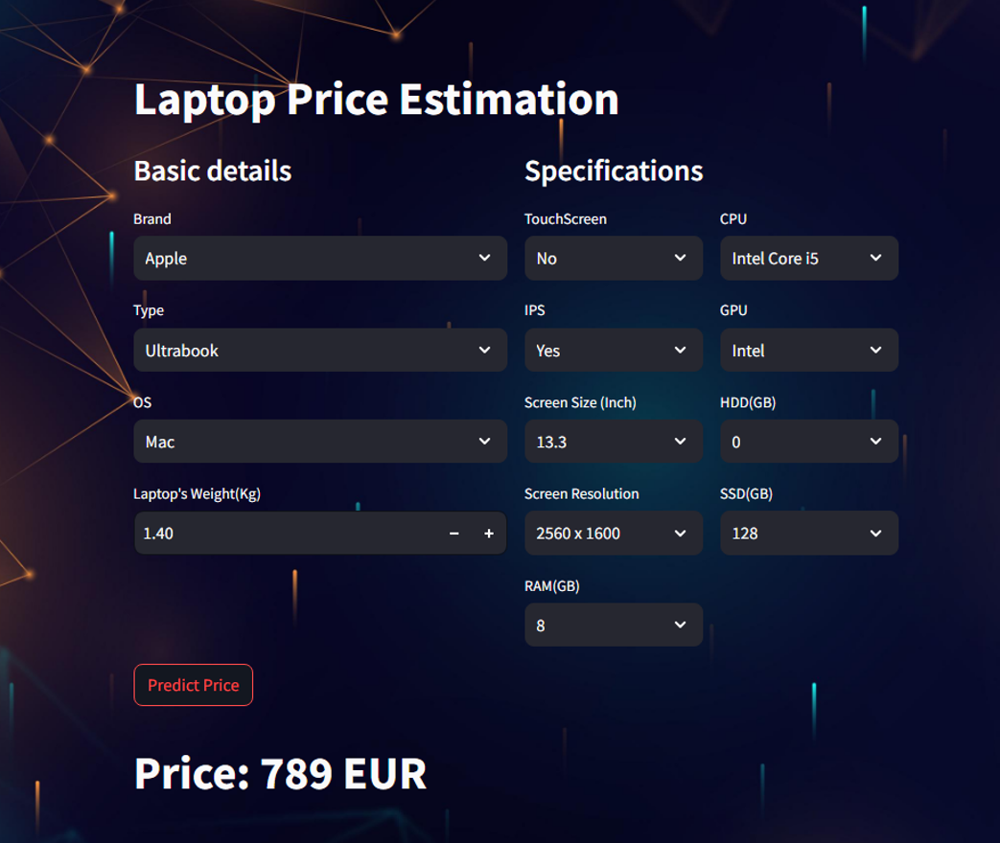
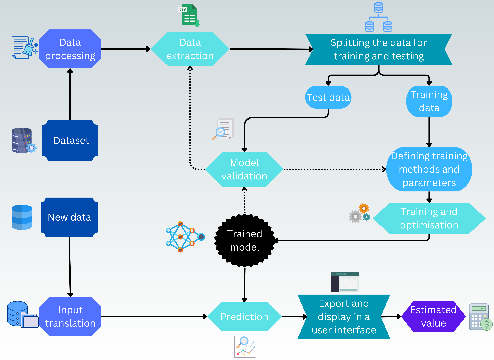

# Electronic-device-price-prediction

## A program that can forecast the price of a product using data collected from a database and present it in a user interface.



---

## Description
<pre>
 The entirety of this program is written in python and to showcase it I used a dataset from Kaggle which contains around 1300 laptops classified by their characteristics and price.<br>
 The following steps were taken to do this:<br>
-processing the dataset and shaping it into an interpretable format as much as possible with Pandas and NumPy(in jupyter lab)<br>
-after processing, the database is split into training data and testing data before various machine learning models are applied<br>
-various machine learning algorithms were used and compared to determine which one can perform more accurately<br>
-the performance was tested using R-squared (R²) and Mean Absolute Error (MAE) coefficients<br>
-the model validity was examined by comparing the predicted values to actual values and by residual analysis<br>
-finally the model is serialized and exported(with Pickle) into a user interface(using Streamlit), where the desired device<br>
 characteristics can be selected by the user and the forecasting can be performed.
</pre>
---

## Block Diagram

Below is a block diagram illustrating the workflow of the project:



---

## Instructions

Follow these simple steps to get started:

1. **Install required python libraries:**
   ```bash
   pip install -r requirements.txt
   
2. **Install jupyter lab and run in cmd(also upload the models):**
   ```bash
   jupyter lab
   
3. **Run the app:**
   ```bash
   streamlit run app.py
